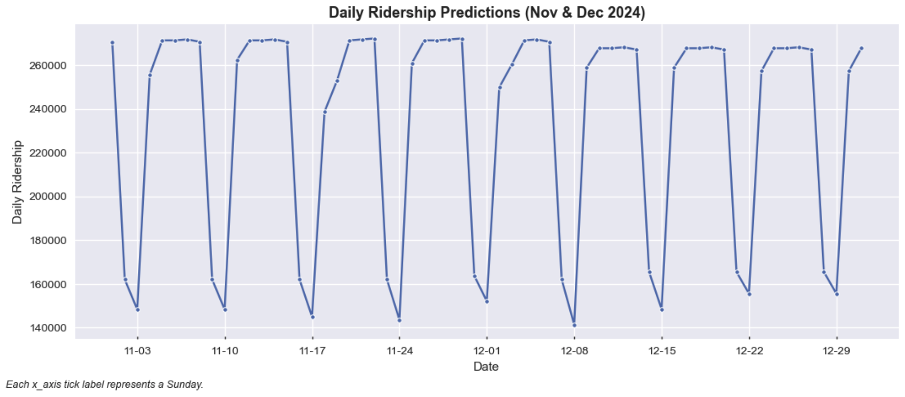

# LRT Kelana Jaya Line Daily Ridership Prediction using XGBoost

This project uses machine learning to predict daily ridership for LRT Kelana Jaya line. It combines historical ridership data with time-related and lag features to forecast daily ridership for November and December 2024. By forecasting ridership with greater accuracy, transportation management can better allocate resources, improve customer service, and make informed decisions about transit operations.

## Project Overview

- **Objective**: Predict daily ridership for November and December 2024 to help with operational decision-making, staffing, and customer experience improvements.
- **Approach**: Built and tuned an XGBoost regression model using time-related features (day of the week, month, etc.) and lag features. The model was evaluated using cross-validation (TimeSeriesSplit) and compared to a baseline approach based on day-of-week averages.
- **Key Result**: The XGBoost model achieved lower RMSE than the baseline, indicating improved predictive performance.

## Methodology

1. **Data Preparation**: Created features capturing time-related information (e.g., day of the week, month) and lagged ridership values to capture recent trends.
2. **Hyperparameter Tuning**: Used Optuna to find optimal hyperparameters for the XGBoost model.
3. **Evaluation**:
   - **Cross-Validation**: Used TimeSeriesSplit to evaluate model performance in a time series context.
   - **Baseline Approach**: Compared the model to day-of-week average ridership calculated from the training set for each day of the week.
   - **Performance Metric**: Root Mean Squared Error (RMSE) to evaluate the prediction accuracy.

## Results

**Findings**:
- Strong weekly seasonality with higher ridership on weekdays and lower ridership on weekends, aligning with historical patterns.
- Ridership is expected to peak on Wednesdays, Thursdays and Fridays and drop significantly on Saturdays and Sundays throughout both months.
- The ridership will likely be slightly higher in November than in December.

**Recommendations**:
- Allocate additional vehicles and staff to handle higher weekday demand, especially midweek.
- Scale back operations on weekends to reduce costs while maintaining sufficient service for expected ridership.
- Closely monitor actual riderhip and adjust operational planning accordingly.

## Business Impact

This model can benefit multiple teams within a transit organization:

- **Operations**: Helps with staffing, vehicle allocation, and scheduling by accurately forecasting peak and off-peak ridership days.
- **Customer Service**: Enhances passenger experience through better crowd management and timely communication.
- **Strategic Planning**: Provides insights into long-term ridership trends, guiding infrastructure investment and expansion planning.
- **Finance**: Assists with budgeting and cost forecasting, ensuring efficient allocation of resources.

## Future Work

- **Incorporate Additional Features**: Include weather data, public holidays and special events data to capture additional factors influencing ridership.
- **Forecasting Methods**: Explore time-series techinques such as Exponential Smoothing and ARIMA.
- **Data Granularity**: Collect hourly ridership if possible for more precise predictions.
- **Broader Deployment**: Expand and integrate this model to other LRT/MRT lines.
